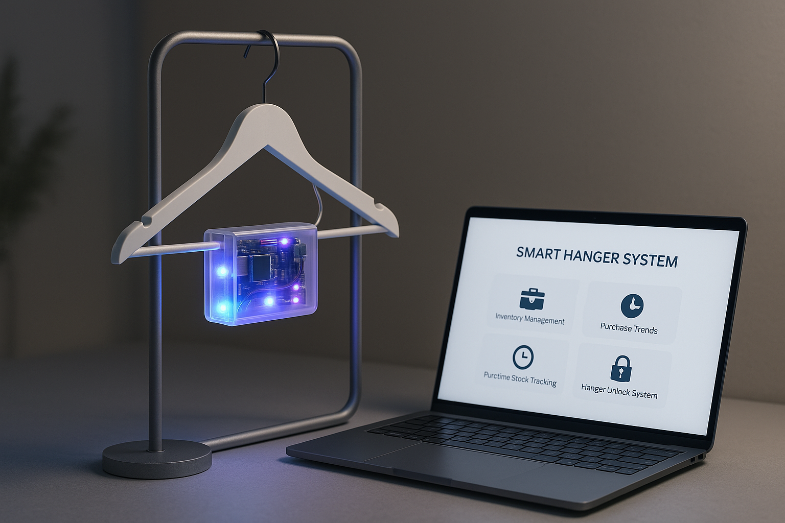

# 👕 SMART HANGER SYSTEM

Welcome to the **SMART HANGER SYSTEM**! This innovative solution is designed to automate clothes management in retail and storage environments, combining **hardware sensors** with a **web-based interface** for enhanced stock tracking, security, purchase trend analysis, and inventory management. Let’s make managing clothes more fun and efficient! 😎

## Features 🌟

### 1. **Stock Tracking 📦**
   - Real-time tracking of clothing items as they move through the system.
   - **Sensors** to detect the presence, quantity, and location of each item.
   - Up-to-date stock info ensures you **never run out** of hot sellers or **overstock**! 📉📈

### 2. **Security 🛡️**
   - Enhanced **security features** to prevent theft and loss.
   - **Alerts** triggered when unauthorized movements or discrepancies are detected.
   - Your inventory is **safe and sound**! 🔒

### 3. **Purchase Trends 📊**
   - **Trend analysis** based on item access and purchases.
   - Helps businesses predict demand, make smart purchasing decisions, and target marketing efforts. 🎯
   - **Data-driven decisions** = smarter business! 💼📈

### 4. **Inventory Management 🗂️**
   - **Automated stock updates** to reduce manual inventory management.
   - A web-based interface for **easy access** to stock info, sales updates, and orders.
   - **Real-time alerts** for low-stock or out-of-stock items. Never miss a sale again! 🚨🛍️

---

## 🧰 Tech Stack

### Hardware
- ESP32 Development Board
- RGB Lights
- LDR Sensor
- Servo Motor
- Jumper Wires, Breadboard, and Power Source

### Software
- Arduino IDE (Embedded Programming)
- HTML/CSS/JavaScript (Frontend Interface)
- Firebase / MQTT (Optional for data communication)
- NodeMCU / MicroPython (optional alternative for control logic)

## 📁 Project Structure
``` SMART_HANGER_SYSTEM/ ├── backend/ │ └── load_inventory.php # Code base for architectural system └── update_inventory # Inventory real time-tracking codebase ├── Docs/ │ └── documentation.pdf │ └── documentation.word ├── firmware/ │ └── smart_hanger.ino # Arduino sketch for ESP32 ├── frontend/ │ ├── index.html # Main dashboard interface │ ├── style.css # Styling for UI │ └── script.js # JavaScript to handle logic  ├── images/ │ └── system_demo.jpg # Demo image of system  └── LICENSE ├── README.md ``` 


---
## How It Works 🤖

The **SMART HANGER SYSTEM** uses a mix of IoT sensors and a web-based interface to manage inventory and analyze trends:

- **Sensors**: Track clothing items as they’re added, removed, or moved within the system.
- **Web Interface**: Provides real-time updates on stock levels, trends, and security alerts.
- **Analytics**: Data on purchase trends help businesses make **smart decisions**. 📊💡

---

## 🖼️ System Demo



---

## Installation 🛠️

### 1. Clone the repository:
   ```bash
   git clone https://github.com/Tamutswa/SMART_HANGER_SYSTEM.git
   ```

### 2. Navigate to the project directory:
   ```bash
   cd SMART_HANGER_SYSTEM
   ```

### 3. Install the necessary dependencies:
   ```bash
   npm install
   ```

### 4. Set up the hardware components according to the provided guide.

### 5. Launch the application:
   ```bash
   npm start
   ```

---

## 📌 To Do

- [ ] Add Firebase/MQTT integration
- [ ] Improve UI/UX on dashboard
- [ ] Add mobile app or voice assistant control
- [ ] Design and print a 3D case for electronics

## Contributing 🤝

We love contributions from the community! 🎉

If you’d like to help, simply fork the repository and submit a pull request. Please follow the project's **coding guidelines** to keep things smooth! 

 ## 🧑‍💻 Author

**Tamutswa Matondo**  
Frontend Developer | Embedded Systems Enthusiast  
📧 [Email](mailto:tamutswamatondo04@gmail.com)  
📞 +263 783 597 194 | +263 717 029 585  
🔗 [GitHub Profile](https://github.com/Tamutswa)

Have questions or need support? Feel free to reach out. Thanks for checking out the **SMART HANGER SYSTEM**! Let's make inventory management a breeze! 😁👚✨


## 📄 License

This project is licensed under the MIT License – see the [LICENSE](LICENSE) file for details.

## Acknowledgements 🙏

This project would not have been possible without the guidance, support, and inspiration of several individuals and resources:

- 👨‍🏫 **Lecturers and Mentors** at the National University of Science and Technology in Zimbabwe for their continuous support and feedback.
- 💻 Open-source communities and contributors whose libraries and documentation made development smoother.
- 🧠 Friends and peers who provided valuable input, testing, and encouragement throughout the project journey.
- 🌍 The GitHub and Stack Overflow communities for being endless wells of technical knowledge and help.

Thank you all for being a part of the SMART HANGER SYSTEM journey! ❤️


